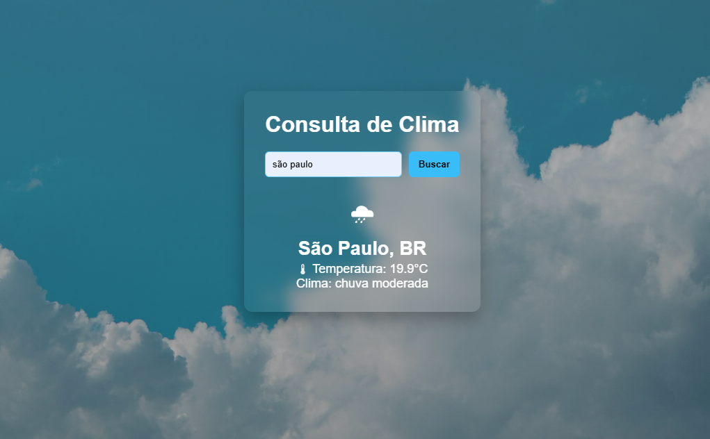

# Weather App | Consulta de clima ☁

Aplicação web para consulta de clima em tempo real utilizando consumo de API externa.

## 🚀 Tecnologias

- HTML5
- CSS3
- JavaScript
- API REST

## 📡 API Utilizada

OpenWeather API

## ✨ Funcionalidades

- Busca de clima por cidade
- Consumo de API externa
- Manipulação de dados em JSON
- Atualização dinâmica da interface
- Tratamento de erros
- Interface responsiva

## 🖥 Demonstração

Aplicação permite consultar temperatura e condições climáticas de qualquer cidade do mundo em tempo real.

## 📦 Como executar

1. Clone o repositório

git clone: https://github.com/vinioliveira-developer/Weather-APP.git

2. Abra o arquivo

## 🌐 Deploy

Aplicação publicada no Vercel.

## 📸 Preview

## 📬 Contato

<a href="https://www.linkedin.com/in/mvinicius-developer/" target="_blank">
   LinkedIn
</a>

 

<a href="https://github.com/vinioliveira-developer" target="_blank">
   GitHub
</a>

 

<a href="mailto:mvinicius.developer@gmail.com">
  📧 Email: mvinicius.developer@gmail.com
</a>

---

⭐ Se você gostou do projeto, fique à vontade para dar uma estrela no repositório!
